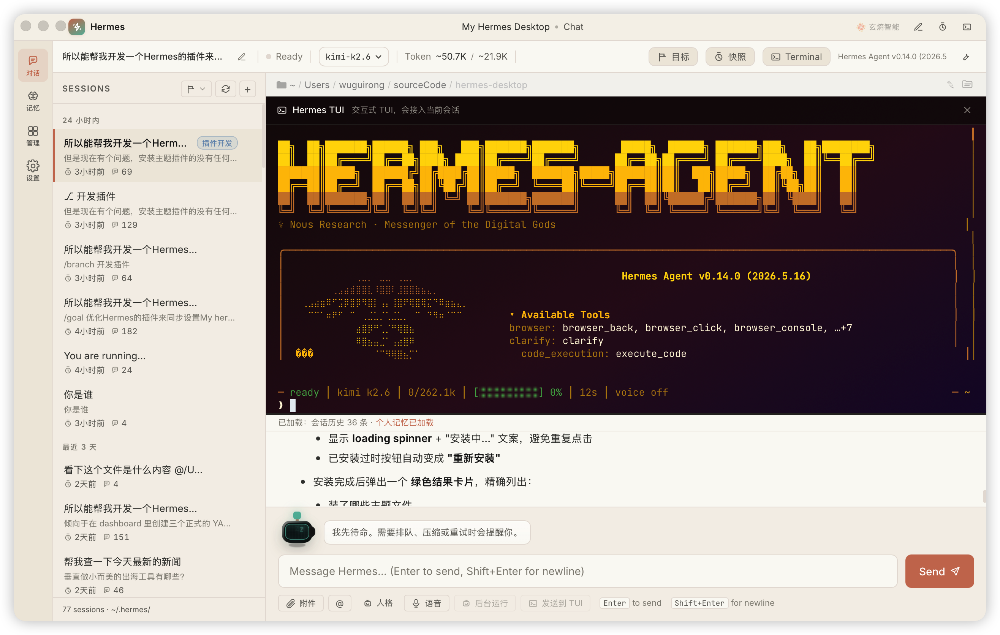
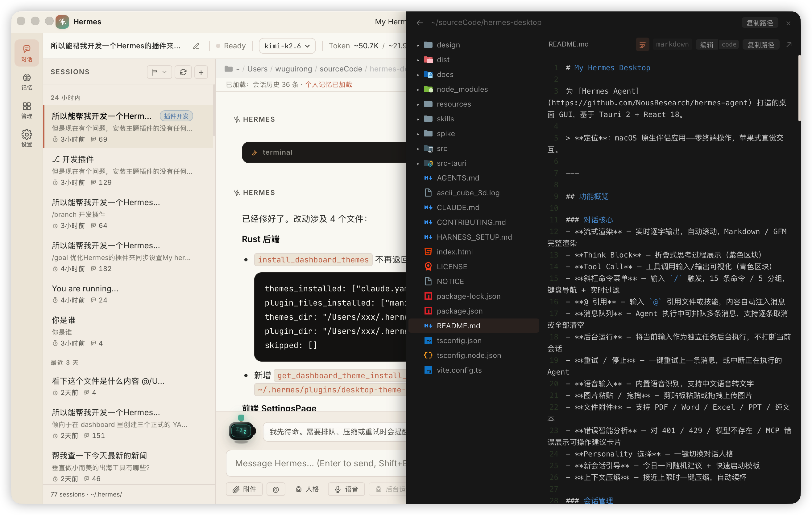
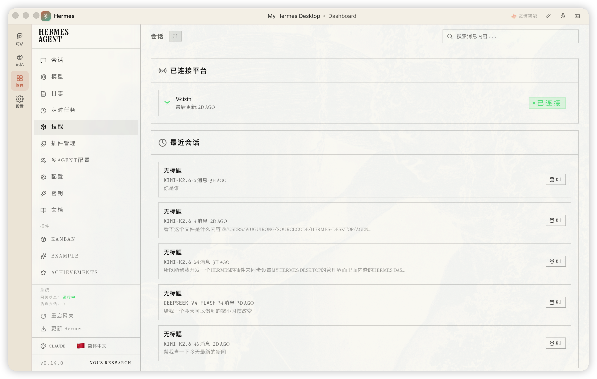
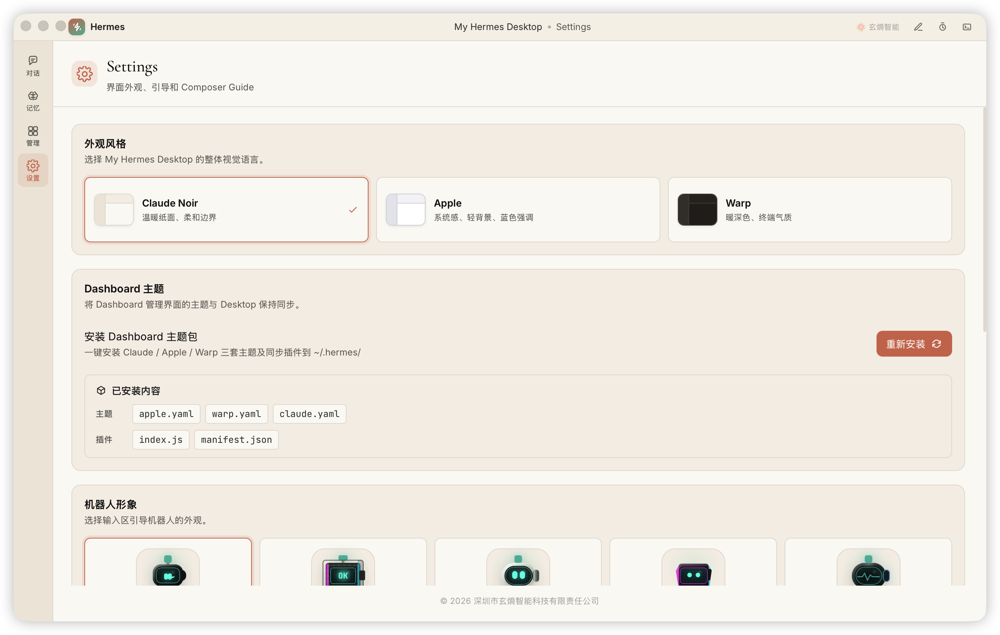

# My Hermes Desktop

为 [Hermes Agent](https://github.com/NousResearch/hermes-agent) 打造的桌面 GUI，基于 Tauri 2 + React 18。

> **定位**：macOS 原生伴侣应用——零终端操作，苹果式直觉交互。

---

## 界面预览

| 对话 + 内嵌终端 | 文件预览 |
| --- | --- |
|  |  |

| Dashboard 管理面板 | 设置中心 |
| --- | --- |
|  |  |

---

## 功能概览

### 对话核心
- **流式渲染** — 实时逐字输出，自动滚动，Markdown / GFM 完整渲染
- **Think Block** — 折叠式思考过程展示（紫色区块）
- **Tool Call** — 工具调用输入/输出可视化（青色区块）
- **斜杠命令菜单** — 输入 `/` 触发，15 条命令 / 5 分组，键盘导航 + 实时过滤
- **@ 引用** — 输入 `@` 引用文件或技能，内容自动注入消息
- **消息队列** — Agent 执行中可排队多条消息，支持逐条取消或全部清空
- **后台运行** — 将当前输入作为独立任务后台执行，不打断当前会话
- **重试 / 停止** — 一键重试上一条消息，或中断正在执行的 Agent
- **语音输入** — 内置语音识别，支持中文语音转文字
- **图片粘贴 / 拖拽** — 剪贴板粘贴或拖拽上传图片
- **文件附件** — 支持 PDF / Word / Excel / PPT / 纯文本
- **错误智能分析** — 对 401 / 429 / 模型不存在 / MCP 错误展示可操作建议卡片
- **Personality 选择** — 一键切换对话人格
- **新会话引导** — 今日一问随机建议 + 快速启动模板
- **上下文压缩** — 接近上限时一键压缩，自动续杯

### 会话管理
- **侧边栏会话列表** — 切换 / 删除（3 秒反悔窗口），自动读取 `~/.hermes/sessions/`
- **彩色标签** — 为会话添加标签（≤5 字），按时间分组 + 按标签筛选
- **状态徽章** — 实时显示执行中 / 排队中 / 完成

### 面板系统
- **文件树** — 工作目录完整文件浏览，双击预览、拖拽引用
- **快照时间线** — 浏览 Hermes 保存的项目快照，一键还原
- **内嵌终端** — Tauri 原生 PTY，Terminal Noir 主题（JetBrains Mono + 琥珀金）
- **工作目录栏** — 显示并切换当前工作目录

### 状态监控
- **TopBar 仪表盘** — 实时显示当前模型、Token 用量、费用估算、运行时长
- **模型切换器** — 下拉选择，只显示已配置 provider 的模型，写入 `config.yaml`

### 记忆编辑器
- **图形化编辑** — 直接编辑 Agent 的 `MEMORY.md` 和 `USER.md`
- **容量感知** — 字符上限进度条，超出时禁止保存

### Dashboard
- **内嵌管理面板** — Kanban / Cron / Config / MCP 等全部委托 `hermes dashboard` iframe
- **自动启动** — 检测并自动启动 Hermes Dashboard 后端
- **主题同步** — 桌面主题变化实时同步到 Dashboard

### 个性化
- **3 套主题** — Claude Noir / Apple / Warp（暖深色）
- **5 种机器人形象** — Classic / Voxel / Anime / Cyber / Pod
- **5 种终端背景** — 暗夜 / 毛玻璃 / 深海 / 暮色 / 暗林
- **字体大小** — 界面 / 终端 / 文件管理器 三区独立调节

### 新手引导
- **安装检测** — 首次运行自动检测 Hermes CLI 状态
- **配置一览** — 版本、路径、API Key、提供商全部可视化核查

### 窗口与快捷键
- **自定义标题栏** — 应用菜单（新建 / 记忆 / Dashboard / 设置 / 终端 / 快照等）
- **原生窗口控制** — 最小化 / 最大化 / 关闭，双击标题栏最大化
- **快捷键面板** — `Cmd+/` 触发全局快捷键速查
- **全局快捷键** — `Cmd+N` 新建会话，`Cmd+W` 关闭面板，`Cmd+Shift+H` 显示/隐藏窗口

---

## 前置条件

### 1. 安装 Hermes Agent

```bash
pip install hermes-agent
# 或参考官方文档的安装方式
```

确认安装成功：

```bash
hermes --version
```

### 2. 安装 Rust（Tauri 编译需要）

```bash
curl --proto '=https' --tlsv1.2 -sSf https://sh.rustup.rs | sh
```

### 3. 安装 Node.js ≥ 18

推荐通过 [nvm](https://github.com/nvm-sh/nvm) 或 [Homebrew](https://brew.sh) 安装：

```bash
brew install node
```

---

## 本地开发

```bash
git clone https://gitee.com/wuguirong/hermes-desktop.git
cd hermes-desktop
npm install
npm run tauri dev
```

Vite dev server 在 `1420` 端口启动，Tauri 窗口自动打开。

## 打包发布

```bash
npm run tauri build
```

产出物在 `src-tauri/target/release/bundle/` 中（macOS 输出 `.app` + `.dmg`）。

## 运行测试

```bash
npm test
```

---

## 架构说明

```
hermes-desktop/
├── src-tauri/                  # Rust 后端（Tauri 2）
│   └── src/
│       ├── main.rs             # 入口
│       ├── lib.rs              # AppState、共享类型、插件注册
│       ├── stream.rs           # ANSI 剥离、流式输出状态机
│       └── commands/           # Tauri 命令（按模块拆分）
│           ├── chat.rs         # 发消息、停止、重试
│           ├── sessions.rs     # 会话 CRUD、标签、快照
│           ├── background.rs   # 后台任务管理
│           ├── dashboard.rs    # Dashboard 启动与主题桥接
│           ├── files.rs        # 文件树、附件上传
│           ├── memory.rs       # MEMORY.md / USER.md 读写
│           ├── setup.rs        # 首次安装检测
│           ├── terminal.rs     # PTY 终端
│           └── tray.rs         # 系统托盘
├── src/                        # React 前端
│   ├── App.tsx                 # 全局状态、路由、事件监听
│   ├── types.ts                # TypeScript 类型定义
│   ├── index.css               # 主题变量 + Terminal Noir 样式
│   ├── appMenu.ts              # 原生应用菜单构建
│   └── components/
│       ├── AppTitleBar.tsx     # 自定义标题栏 + 应用菜单
│       ├── ChatView.tsx        # 聊天主区域 + 输入框
│       ├── Sidebar.tsx         # 会话列表侧边栏
│       ├── FileTreePanel.tsx   # 文件树面板
│       ├── SnapshotPanel.tsx   # 快照时间线
│       ├── TerminalPanel.tsx   # 内嵌终端
│       ├── WorkingDirBar.tsx   # 工作目录栏
│       ├── KeyboardShortcutsPanel.tsx
│       ├── chat/               # 聊天区子组件
│       │   ├── MessageBubble.tsx    # 消息气泡（think/tool 可视化）
│       │   ├── SlashCommandMenu.tsx # 斜杠命令菜单
│       │   ├── AtMentionMenu.tsx    # @ 引用菜单
│       │   ├── ModelPicker.tsx      # 模型切换器
│       │   ├── PersonalityPicker.tsx
│       │   ├── GoalBar.tsx          # 目标状态栏
│       │   ├── ContextBar.tsx       # 上下文用量
│       │   ├── GuideBot.tsx         # 新手引导
│       │   └── RefPickerPanel.tsx   # 文件/技能引用选择
│       └── topbar/
│           └── TopBar.tsx      # 顶部仪表盘
```

## 通信机制

每次发送消息时，Rust 层执行：

1. 调用 `hermes chat -q "<message>" [--resume <session_id>]`
2. 逐行读取 stdout，剥离 ANSI 转义码（`stream.rs`）
3. 状态机解析：普通文本 / think block / tool call / status / session_stat
4. 通过 Tauri 事件 `hermes:chunk` 推送到前端
5. 前端实时更新 React 状态，渲染流式内容

---

## 常见问题

**Q: 提示 "Failed to start hermes"**  
A: 确保 `hermes` 在 PATH 中：`which hermes`。若通过 pip 安装，确认 `~/.local/bin` 在 PATH 里。

**Q: 会话列表为空**  
A: 先在终端跑一次 `hermes chat`，生成 `~/.hermes/sessions/` 目录后刷新。

**Q: Dashboard 面板无法加载**  
A: 确认已安装 `hermes dashboard` 相关依赖，或手动运行 `hermes dashboard start` 检查输出。

**Q: Think block 没有正确折叠**  
A: Hermes 不同版本的 think block 标记可能不同，在 `src-tauri/src/stream.rs` 中调整检测字符串。

---

## 贡献

欢迎 Issue 和 Pull Request！详见 [CONTRIBUTING.md](CONTRIBUTING.md)。

## 许可证

[Apache License 2.0](LICENSE)

Copyright © 2026 深圳市玄熵智能科技有限责任公司
